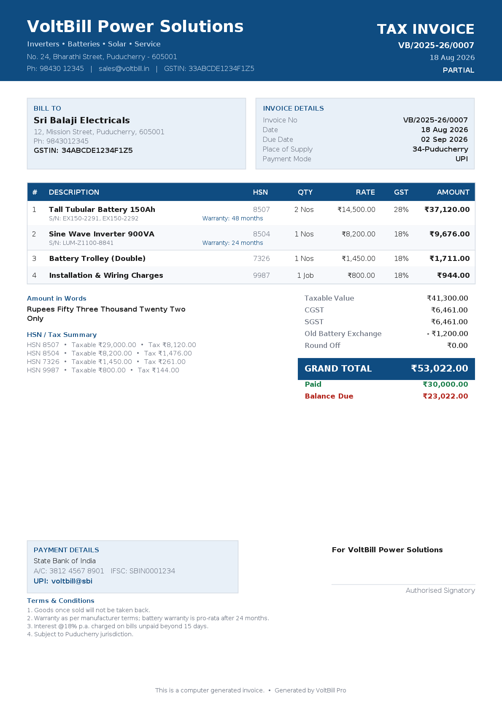

# VoltBill Pro — Inverter & Battery Billing Software

Professional offline-first **GST billing and business management** Android app built for
inverter, battery and solar dealers.

Native **Kotlin + Jetpack Compose (Material 3)** with a **Room** database. Everything works
without internet — no subscription, no server, no account.

---

## 📥 Getting the APK

**Fastest way — no Android SDK needed.** Clone the repo and run one command:

```bash
git clone https://github.com/SASIxKING/SASIxKING.git
cd SASIxKING && git checkout arena/01a015ba-sasixking
./build-apk.sh --ci
```

That enables the GitHub Actions build and pushes it. When the run finishes (~5 min), open
[the Actions tab](https://github.com/SASIxKING/SASIxKING/actions), click the latest run and
download the **VoltBillPro-APK** artifact — it contains the installable
`VoltBillPro-release.apk`.

> The extra step exists because the automation account that created this branch is not
> permitted to write to `.github/workflows/`. The workflow is ready at
> [`ci/android-build.yml`](ci/android-build.yml); the command above just moves it into place.
> You can equally do it by hand: **Add file ▸ Create new file** ▸ name it
> `.github/workflows/android-build.yml` ▸ paste that file's contents ▸ Commit.

### Build it yourself instead

If you have Android Studio (or a JDK 17 + Android SDK):

```bash
./build-apk.sh
```

This creates the signing key, runs the tests and writes `dist/VoltBillPro-release.apk`.
The Gradle wrapper is committed, so nothing else needs installing.

### Installing on the phone

Copy the APK across, tap it, and allow *Install unknown apps* when Android asks.
Min Android 7.0 (API 24), targets Android 14 (API 34).

## ✨ Features

### Billing & GST
- **GST tax invoices** — CGST/SGST for intra-state, automatic **IGST** for inter-state
  (switches itself based on the customer's state code)
- Per-line **quantity, rate, discount %** and independent GST slabs (28% batteries,
  18% inverters, 12% solar …)
- **Old battery exchange / buy-back** deduction — the thing generic billing apps never have
- Automatic **round-off**, **amount in words** (Indian lakh/crore system)
- Invoice numbering `VB/2025-26/0001`, auto-resets each financial year
- Payment modes: Cash / UPI / Card / Bank / Credit

### A4 PDF invoices



Generated with the native `PdfDocument` API — branded header, bill-to/invoice-details panels,
itemised table with **serial numbers and warranty per line**, tax summary by HSN, bank + UPI
details, T&C and signature block. **Share straight to WhatsApp**, email or Drive.

### Inventory
Stock per item with **low-stock alerts**, purchase vs selling price, HSN codes, brand, model,
capacity (150Ah / 900VA / 330W), stock-in entries and a full **movement audit trail**.
Stock is deducted automatically when a bill is saved.

### Warranty tracking
Sell a serialised battery or inverter → **warranty cards are created automatically**, one per
serial number, with the expiry date computed from the product's warranty period.
Search by serial, see *Active / Expiring / Expired / Claimed*, and record claims.

### Service & AMC
Job cards for **installation, service visits, complaints, AMC and battery water top-ups** —
technician, schedule, charges and status workflow (Open → In progress → Completed).

### Customers
Retail / Dealer / Corporate / AMC parties with GSTIN, full address, state code (drives the
IGST decision), and ledger history.

### Reports
Today / This month / Financial year: sales, collections, **GSTR-1 style tax summary**
(taxable value, CGST, SGST, IGST), stock value by category and **outstanding receivables**.

### Settings
Your shop's name, GSTIN, address, bank + UPI details, invoice prefix, T&C and signatory —
all printed on the invoice. Dark theme included.

---

## 🧾 Business defaults

Seeded on first launch with a realistic dealer catalogue (Exide/Amaron tubular batteries,
Luminous/Microtek inverters, solar panels, stabilizers, trolleys, distilled water,
installation and AMC services) so the app is usable immediately. All of it is editable.

Defaults target **India / GST**, ₹ currency, Puducherry state code 34 — change in Settings.

---

## 🏗 Architecture

```
app/src/main/java/com/voltbill/pro/
├── data/         Room entities, DAOs, database + seed, DataStore settings, Repository
├── domain/       GST engine — line tax, totals, round-off, ₹ formatting, amount in words
├── pdf/          A4 invoice renderer (native PdfDocument) + share sheet
└── ui/           Compose screens: dashboard, invoices, customers, products,
                  warranty, service, reports, settings + Material 3 theme
```

Single-Activity Compose app, `AppViewModel` exposing Room `Flow`s as `StateFlow`,
navigation-compose for routing. No network permission is used for business data.

The GST engine is covered by unit tests (`app/src/test/.../GstEngineTest.kt`) that run in CI
before the APK is assembled: CGST/SGST split, IGST, line discounts, exchange deduction,
round-off, Indian digit grouping, amount-in-words, invoice numbering and warranty date maths.

---

## ⚠️ Notes

- The release APK from CI is signed with a **keystore generated during the build**, which is
  fine for sideloading but means each run produces a different signing key. For Play Store
  distribution or stable in-place upgrades, create your own keystore once and store it as
  repository secrets (`VOLTBILL_KEYSTORE`, `VOLTBILL_STORE_PASSWORD`,
  `VOLTBILL_KEY_ALIAS`, `VOLTBILL_KEY_PASSWORD`).
- Deleting an invoice does not automatically restore stock — adjust it from the Stock screen.
- Data lives on the device. Take backups before switching phones.
